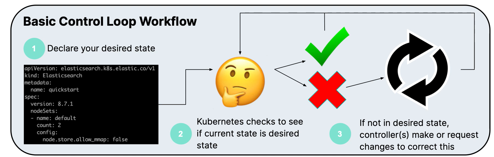
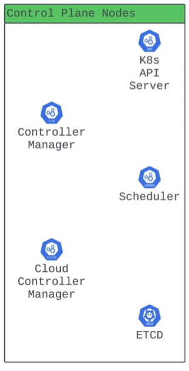
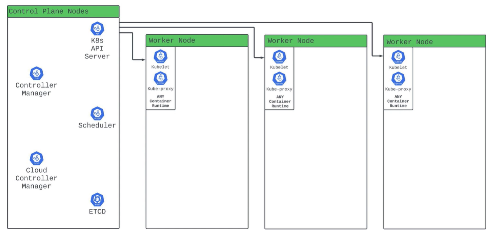
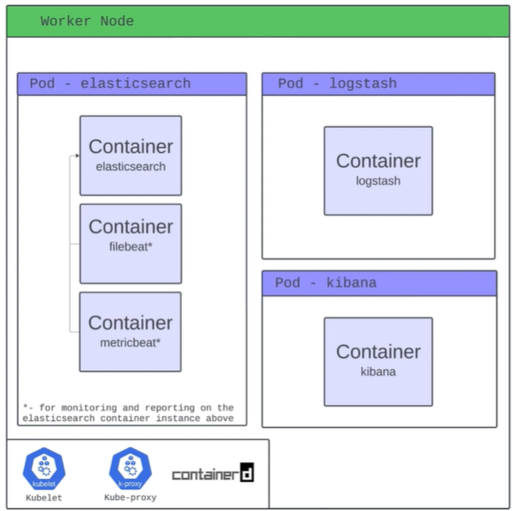

# Kubernetes Core Concepts 

1. Kubernetes is a container orchestration engine. 
2. Kubernetes relies on Controllers (Control Loops) 

CNCF mentions Kubernetes as the "Operating System for Cloud".  

### Basic Control Loop Workflow 

Controllers are async in nature and hierarchial - Generally have a cascadding set of responsibilities. 

## Kubernetes Cluster Infrastructure 
The components that make up Kubernetes 

In general, Kubernetes is splits into 2 planes - Control Plane and Worker Nodes 

### Control Plane 

### Worker Nodes 

## Kubernetes Objects 
"The Things we Deploy"

- YAML [Often called as Manifests]

### POD 

### Kubernetes Storage 

1. Volumes:  
Ephemeral vs. Persistent 
Persistent Volumes 
- Persistent Volume Claims 
- Container Storage Interface 